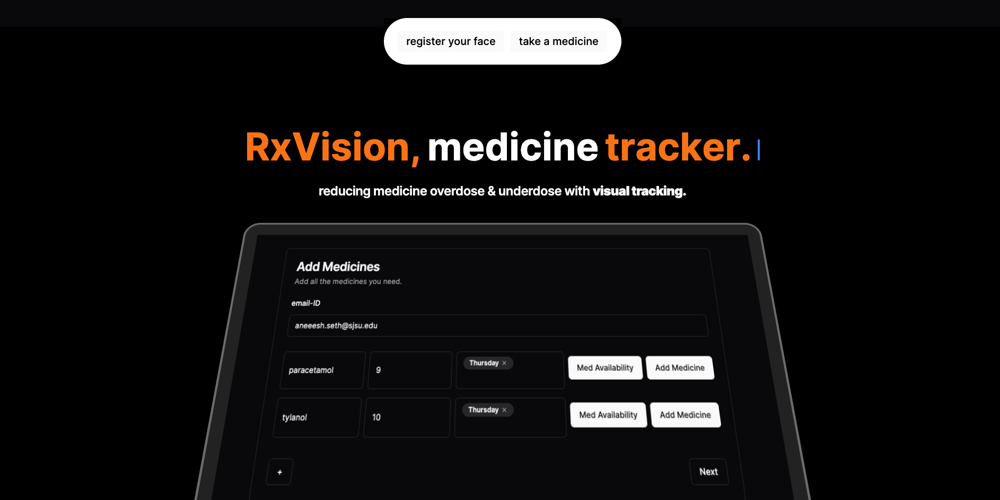
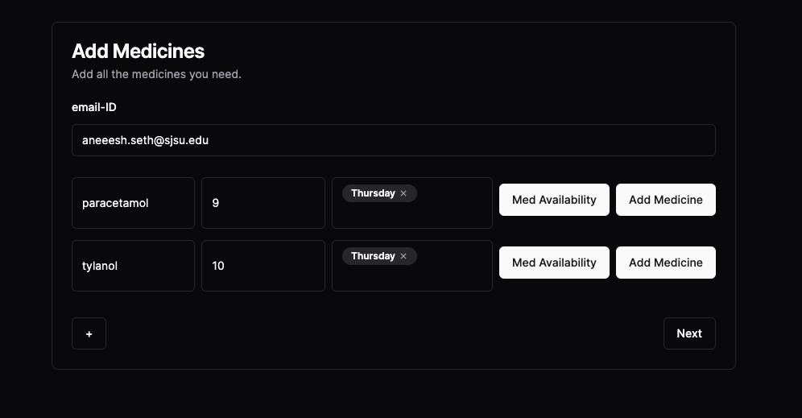
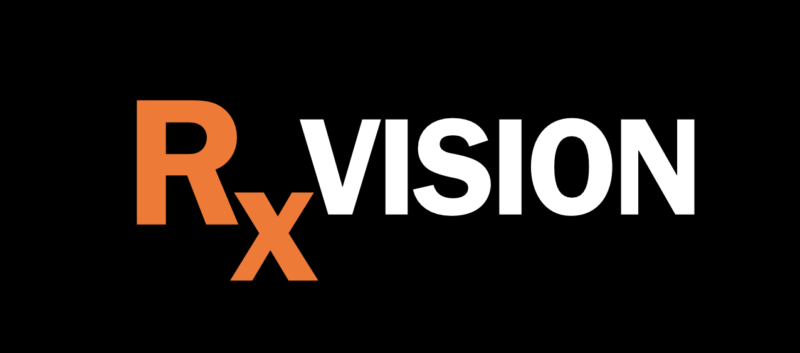

# RxVision

**RxVision** is here to mitigate drug underuse and overuse

Improper drug usage is a major healthcare concerns in today's times. Patients, especially of the diseases where they can't take care of their own medications, are at high risk of additional complications or even deaths in cases of under or overuse.  RxVision is backed by paired recognition of the drug and its receiver to assist in validation of the correct drug-patient pairs while keeping a track of their individual dosage timings. 

## References

- Pill Image Dataset trained on GoogLeNet [Pharmaceutical Drug Recognition](https://www.kaggle.com/datasets/gauravduttakiit/pharmaceutical-drug-recognition?select=train): The dataset features 10 different classes of Pharmaceutical Drugs. The dataset contains about 9500+ labelled images including the validation images. The classes are - Alaxan,Bactidol, Bioflu, Biogesic, DayZinc, Decolgen, Fish Oil, Kremil S, Medicol, Neozep.
- Face Recognition trained on Keras FaceNet [FaceNet](https://github.com/davidsandberg/facenet):  This is a TensorFlow implementation of the face recognizer described in the paper
["FaceNet: A Unified Embedding for Face Recognition and Clustering"](http://arxiv.org/abs/1503.03832). The project also uses ideas from the paper ["Deep Face Recognition"](http://www.robots.ox.ac.uk/~vgg/publications/2015/Parkhi15/parkhi15.pdf) from the [Visual Geometry Group](http://www.robots.ox.ac.uk/~vgg/) at Oxford.

## Features

- **Facial Recognition Integration**:
Utilizing Face ID detection powered by Facenet, the application will allow users to authenticate their identity securely. This feature ensures that only authorized individuals can access the medication management functionalities of the app.

- **Medication Database Integration**:
We will integrate a comprehensive database of medications, including generic and brand-name drugs, leveraging machine learning models such as GoogLeNet. This database will facilitate real-time verification of medication availability and compatibility with user prescriptions.

- **User Medication Profile**:
Users can create personalized medication profiles within the app, inputting details of their prescribed medications, dosages, and schedules. This profile serves as a reference point for the application to cross-reference with the medication database during verification.

- **Facial Recognition Medication Verification**:
Users can use their device's camera to scan the medication they intend to take. The application will employ facial recognition technology to verify the scanned medication against the user's prescription profile. If a match is found, the app will update the medication intake log accordingly.

- **Automated Compliance Monitoring**:
For users who fail to take their prescribed medications on time, the application will employ automated backend processes to monitor compliance. At midnight each day, the system will trigger an email notification to users who missed their medication doses, reminding them to adhere to their prescribed regimen.

## Screenshots

*Home Page*

*Registration Page*

## Authors

- [@Utkarsh Prakash Srivastava](https://www.github.com/utkarsh231)
- [@Raghav Rawat](https://github.com/rawatraghav)
- [@Aneesh Seth](https://github.com/aneeshseth)
- [@Akshat Namdeo](https://github.com/itsak610)

